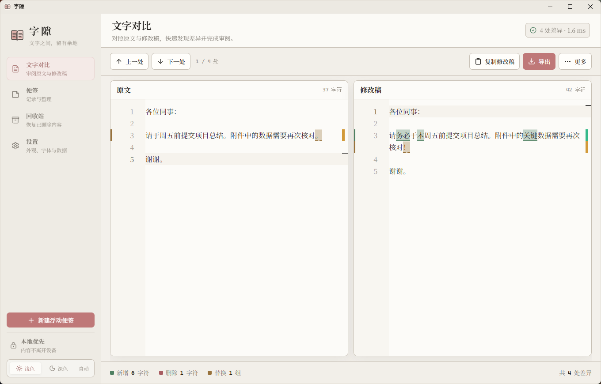
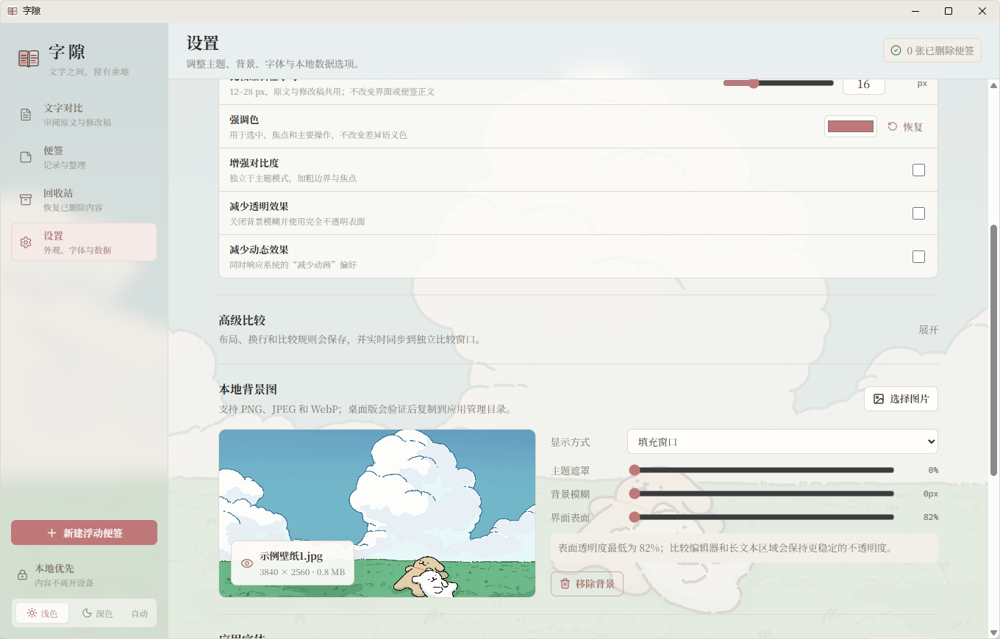

# 字隙

字隙是一个面向日常办公的本地优先桌面工具。它把原文与修改文并排展示，以确定性规则高亮新增、删除和替换内容；同时提供可独立悬浮的桌面便签、自动保存、历史版本、回收站、样式定制和多格式导出。

当前版本为第一阶段 MVP（0.1.0），技术栈为 Tauri 2、React、TypeScript、Vite、Monaco Editor、jsdiff 与 SQLite。

## 界面预览





## 下载与安装

普通 Windows 用户无需安装 Node.js、Rust 或其他开发工具。请前往 [GitHub Releases](https://github.com/Iridium1024/zixi/releases/latest)，下载名称以 `Windows-x64-Setup.exe` 结尾的安装包并双击安装。

- `Zixi-<版本>-Windows-x64-Setup.exe`：推荐普通用户使用。
- `Zixi-<版本>-Windows-x64.msi`：供需要 MSI 的管理或批量部署环境使用。
- `Source code (zip)` / `Source code (tar.gz)`：仅供开发者获取源码，不是可直接运行的软件。
- `SHA256SUMS.txt`：用于核对安装包是否完整、是否与发布页提供的文件一致。

当前公开构建面向 Windows 10/11 x64，尚未进行商业代码签名，因此 Windows SmartScreen 可能显示“未知发布者”。请只从本仓库 Releases 页面下载。安装升级或卸载程序不会主动删除 `%APPDATA%\com.zixi.desktop` 中的用户数据库与外观资源。

## 主要能力

- 双栏文字比较：精确、审阅、宽松三种规则；上一处/下一处、统计、交换与同步滚动。
- Unicode 友好：覆盖中文、英文、数字、标点、换行、空白、组合字符与 emoji；长文本在 Web Worker 中计算并有可见的降级策略。
- 桌面便签：新建、搜索、编辑、独立窗口、置顶、回收站；回收站支持明确的多选、筛选内全选、批量恢复、批量永久删除与清空，以及每张最多 10 个、至少间隔 5 分钟的稀疏内容版本。
- 外观：浅色、深色、跟随系统三种主题；Windows 主窗口原生标题栏随已解析主题协调；增强对比、减少透明和减少动画作为独立无障碍偏好。
- 本地背景与字体：背景图可预览、调整遮罩/模糊/表面透明度并保存管理副本；字体可按界面、比较器和默认便签三个范围导入应用。
- 便签样式：每张便签可单独设置字体、字号、行距、文字色、背景色和透明度；单张覆盖优先于全局默认。
- 本地持久化：SQLite + WAL；比较会话、设置、便签和版本记录自动保存。
- 导出：TXT、Markdown、JSON、带高亮的 HTML 和 Unified Diff；保存路径由用户明确选择。
- 比较正文：原文与修改稿共用 12–28px 的持久化字号和联动行高；界面字号、比较正文字号与便签正文字号彼此独立。
- 桌面生命周期：单实例、主窗状态恢复、关闭到系统托盘、托盘新建便签与退出。

## 从源码开发

要求：

- Node.js 20.19+ 或 22.12+
- npm 10+
- Rust stable（构建桌面版时）
- Windows 上构建 Tauri 需要 WebView2 与 MSVC C++ 构建工具；也可以使用 LLVM + cargo-xwin。

安装依赖并启动浏览器开发界面：

```powershell
npm ci
npm run dev
```

启动 Tauri 桌面开发版：

```powershell
npm run tauri dev
```

## 验证与构建

完整前端质量门：

```powershell
npm run check
```

该命令依次执行 TypeScript 类型检查、ESLint、Vitest 和 Vite 生产构建。桌面安装包构建：

```powershell
npm run tauri build
```

开发期原生可执行文件会生成在 `src-tauri/target/<target>/<profile>/zixi.exe`。Windows 标准发布环境优先使用 MSVC Build Tools；本项目也已在 LLVM `clang-cl` + `lld-link` + cargo-xwin sysroot 的替代工具链上完成原生编译。

若 Windows 机器未安装 MSVC C++ workload，可在准备好 LLVM 与 cargo-xwin 后执行 Rust 检查：

```powershell
cargo xwin check --cross-compiler clang --target x86_64-pc-windows-msvc --manifest-path src-tauri/Cargo.toml
```

## 数据位置与备份

SQLite 文件名为 `zixi.db`，位于 Tauri 的应用配置目录。Windows 默认位置为：

```text
%APPDATA%\com.zixi.desktop\zixi.db
```

启用 WAL 后同目录还可能出现 `zixi.db-wal` 与 `zixi.db-shm`。应用的“设置 → 数据与备份 → 定位本地数据库”可以在资源管理器中定位数据库。

外观资源同样保存在该配置目录下：

```text
%APPDATA%\com.zixi.desktop\appearance\backgrounds
%APPDATA%\com.zixi.desktop\appearance\fonts
```

桌面版会在用户明确选择文件后验证格式，再复制到这些应用管理目录。移动、重命名或删除原文件不会影响已经应用的资源；在应用内移除资源时，只删除字隙自己的副本，不会删除原文件或系统字体。

冷备份建议：先从系统托盘退出字隙，再复制整个 `com.zixi.desktop` 目录；恢复时也应在应用完全退出后替换整个目录，避免遗漏 WAL 中尚未合并的数据。

浏览器开发预览不具备 Tauri 原生 SQLite 能力，会使用浏览器 `localStorage` 作为可测试的降级存储；它与桌面版数据库不是同一份数据。

## 隐私与安全

- 文字比较在本机 Web Worker 中完成，不调用 AI 或云端服务。
- 便签、比较会话、设置和版本记录默认只保存在本机。
- 导出仅在用户选择目标路径后写入；应用不会自动上传导出文件。
- 导入的背景图和字体仅在本机应用配置目录中使用，不上传、不安装到操作系统，也不会随公开构建产物分发。
- Tauri 使用最小能力清单：导出写入保存对话框授予的路径；外观导入只由主窗口调用 Rust 命令打开系统选择器并立即把所选文件复制到受限应用配置目录，前端不能向导入命令提交任意路径；外部打开能力仅用于在资源管理器中定位本地数据库。

## 外观格式与回退

- 背景图稳定支持 PNG、JPEG/JPG、WebP，单文件上限 24 MB，最长边不超过 10000 像素且总像素不超过 4000 万。
- 应用字体支持 WOFF2、WOFF、TTF、OTF，单文件上限 12 MB；TTC、Type 1、字体集合及特殊可变字体不承诺兼容。
- 应用随包提供 OFL 1.1 许可的 Noto Serif SC（思源宋体）可变字体，界面、比较编辑器和跟随默认设置的便签无需依赖系统字体即可使用；字体文件与许可证位于 Tauri 的 `fonts` 资源目录。
- 文件扩展名必须与实际文件头一致。损坏、伪造或浏览器/WebView 无法解析的文件会被拒绝并显示原因。
- 背景资源丢失时回退主题默认背景；字体加载失败、缺少字形或被删除时回退系统中文字体栈，应用仍可启动。
- “跟随系统”会在运行期间监听系统浅深色偏好；增强对比度不占用主题选项。

## 已知限制

- 第一阶段不提供云同步、账号、多用户协作或 AI 语义等价判断。
- 不解析 Word 富文本，也不提供 PDF/DOCX 高保真导出。
- Unified Diff 使用 jsdiff 生成标准上下文 hunk；无业务差异时只输出文件头。它针对纯文本，不保留 Word 等富文本样式。
- 超过约 10 万字符的比较会优先转为行级策略；极端差异会退化为全文替换，以保证输入界面仍可响应。
- 便签列表尚未虚拟化；MVP 适合日常数量的便签，不以数万条记录为目标。
- 字体显示名首版使用受控文件名，不解析或修改字体许可证、内部家族冲突及高级可变轴；同一文件内容使用 SHA-256 标识避免重复复制。
- 浏览器开发预览会以 Data URL 临时模拟本地外观资源；桌面版的应用管理副本与 SQLite 设置才是正式行为。
- 跨全屏应用强制置顶、鼠标穿透和桌面壁纸层不在当前范围。

## 许可证

本项目使用 [MIT License](./LICENSE)。第三方直接依赖、版本与许可证见 [THIRD_PARTY_NOTICES.md](./THIRD_PARTY_NOTICES.md)。项目仅借鉴公开项目的架构和交互思路，没有复制许可证不明确项目的代码、品牌或资源。
